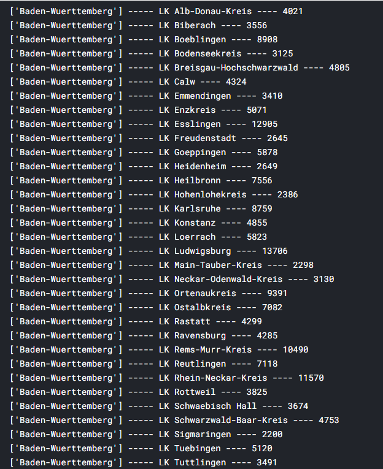
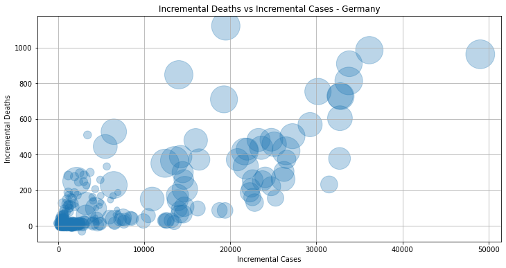
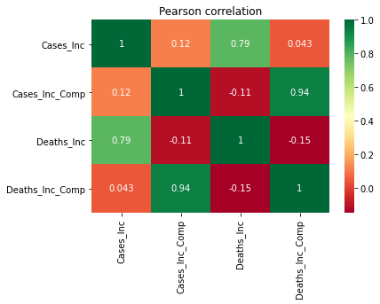

# COVID-19 Trends in Deutschland

## To analyse and show how covid 19 is spreading differently in the different continent on the earth planet.

**Author** : SHAILESH DHAMA

The 2019 Novel Coronavirus (COVID-19) continues to spread in countries around the world. This dataset provides daily updated number of reported cases & deaths in Germany on the federal state (Bundesland) and county (Landkreis/Stadtkreis) level. In addition, I provide geospatial shape files and general state-level population demographics to aid the analysis.
                
### Dataset :

The dataset consists of two main csv files: covid_de.csv and demgraphics_de.csv. The geospatial shapes are included in the de_state.* files. See the column descriptions below for more detailed information.

covid_de.csv: COVID-19 cases and deaths which will be updated daily.
demographics_de.csv: General Demographic Data about Germany on the federal state level. Those have been downloaded from Germany's Federal Office for Statistics (Statistisches Bundesamt) through their Open Data platform GENESIS.

de_state.*: Geospatial shape files for Germany's 16 federal states. Downloaded via Germany's Federal Agency for Cartography and Geodesy.

## Approach:

### Data processing & Exploratory Data Analysis:

    1.Import Libraries
    2.Load Data
    3.Dataset Exploration
    4.Descriptive Analysis
    5.Visualization
    6.Epidemiology terms: Lethality, Incidence,etc.
    7.Geospatial analysis
    8.Forecasting
           
## RESULTS :

#### Top-10 country most affected by COVID-19


#### Top-10 country most killed by COVID-19


#### COVID-19 confirmed case distribution


#### 6 countries having huge COVID-19 confirmed cases in the world


#### 6 countries having huge COVID-19 deaths in the world


#### SARS-COV2 cases in the worldwide


#### SARS-COV2 fatalities in the worldwide


#### COVID-19 most affected cases in the 20 countries


#### SARS-COV2 incidence per 100000 inhabitants


#### SARS-COV2 new cases worldwide


#### SARS-COV2 new fatalities worldwide


#### SARS-COV2 lethality worldwide


#### Population and population density


#### Cases and deaths per state


#### Cases normalised to population


#### Deaths normalised to population


#### Cases in counties over their mean


#### Hot-Spots in Germany


#### Time dependence


#### Age and Gender dependence


#### Development of Confirmed Cases in Germany


#### Incremental Development of Confirmed Cases in Germany


#### Relative Changes of Confirmed Cases in Germany


#### COVID-19 Impacts during weekdays


#### COVID-19 Logarithmic Impacts during weekdays


#### Incremental Deaths vs Incremental Cases in Germany


### COMPARISON BETWEEN GERMANY AND INDIA IN COVID-19 SPREAD


### Correlations
#### Pearson correlation


#### Spearman correlation


### For further information:

Please review the narrative of our analysis in [our jupyter notebook](./covid19-eda-comparison-between-india-germany.ipynb)

For any additional questions, please contact **shaileshettyd@gmail.com)

##### Repository Structure:

```

├── README.md                                                                                                                            <- The top-level README for reviewers
├── covid-19-analysis-and-visualisations.html;covid19-eda-comparison-between-india-germany.ipynb;geospatial-demographics-analysis.ipynb  <- narrative documentation of analysis
├── netflix_titles.csv                                                                                                                   <- Dataset
└── images                                                                                                                               <- generated from code

```
## Citing :

```
@misc{Shailesh:2020,
  Author = {Shailesh Dhama},
  Title = {COVID-19 Trends in Deutschland},
  Year = {2020},
  Publisher = {GitHub},
  Journal = {GitHub repository},
  Howpublished = {\url{https://github.com/ShaileshDhama/COVID-19-Trends-in-Deutschland}}
}
```
